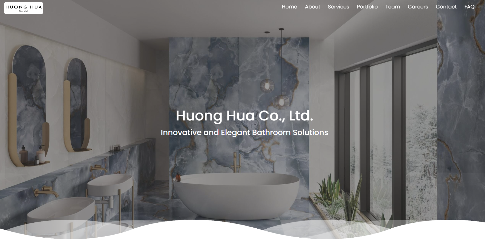

# Huong Hua Co. Ltd. Website Project

This README provides detailed information about the English version of the Huong Hua Co. Ltd. website. The website is tailored for a company in HCMC, Vietnam specializing in bathroom equipment design and construction, offering comprehensive insights into the company's services, portfolio, career opportunities, and more.

It is designed to help the company expand its online presence, attract new (and foreign) clients, and showcase its expertise in bathroom solutions. The website features a clean, modern design with a user-friendly interface, making it easy for visitors to navigate and explore the company's offerings.

## Table of Contents

- [Overview](#overview)
- [User Interface](#user-interface)
- [Features](#features)
  - [1. Home Page](#1-home-page)
  - [2. About Us](#2-about-us)
  - [3. Services](#3-services)
  - [4. Portfolio](#4-portfolio)
  - [5. Team](#5-team)
  - [6. Career](#6-career)
  - [7. Contact](#7-contact)
  - [8. FAQ](#8-faq)
  - [9. Client Testimonials](#9-client-testimonials)
  - [10. Footer](#10-footer)
- [Technology Stack](#technology-stack)
- [Live Deployment](#live-deployment)
- [Setup and Installation](#setup-and-installation)
- [Configuration](#configuration)
- [Contributing](#contributing)
- [Support](#support)
- [License](#license)

## Overview

Huong Hua Co. Ltd. is dedicated to delivering top-quality bathroom solutions, ranging from design to installation and renovation. The website serves as a digital platform to showcase the company's expertise, project portfolio, client testimonials, and career opportunities.

## User Interface

  

## Features

### 1. Home Page

- Introduction to Huong Hua Co. Ltd.
- Quick navigation links to various sections of the website.

### 2. About Us

- Details about the company's history, mission, and values.
- Overview of the company's specializations in bathroom solutions.

### 3. Services

- Detailed descriptions of services offered, such as bathroom design, installation, and renovation.
- Custom content aligning with the company's expertise in bathroom solutions.

### 4. Portfolio

- Showcase of completed projects.
- Images and descriptions of various bathroom designs and constructions.

### 5. Team

- Information about the key team members.
- Profiles of designers, project managers, and other crucial staff.

### 6. Career

- Current job openings and a form for potential candidates to apply.
- Integration with Formspree for form submission handling.

### 7. Contact

- Contact information and a form for inquiries, integrated with Formspree.
- Embedded Google Map showing the location of the company.

### 8. FAQ

- Answers to frequently asked questions about services, pricing, project timelines, etc.

### 9. Client Testimonials

- Feedback and reviews from past clients.
- Reflects the company's commitment to quality and customer satisfaction.

### 10. Footer

- Additional navigation links.
- Social media links and contact information.

## Technology Stack

- React: For building reusable components.
- Bootstrap: For responsive design.
- jQuery: Used for Bootstrap components and additional interactivity.
- Django: For backend development (full code not included in this repository due to the company's privacy reasons).
- PHP: For form handling and server-side processing.
- Google Maps API: For embedding location maps.
- MongoDB: For storing client testimonials and job applications.
- MySQL: For storing user data and website analytics.
- MailChimp: For newsletter subscription and email marketing.
- Formspree: For form submission handling.
- Docker: For containerization and deployment.
- Nginx: For web server configuration and load balancing.
- AWS EC2, RDS, DocumentDB, S3, Gateway, CloudFront, and Route 53: For deployment, hosting, and cloud services.
- Prettier: For code formatting and consistency.
